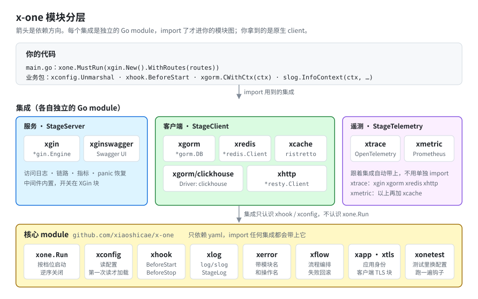

# xone

Go 三方库集成框架：**写一个配置文件，调一次 `xone.Run`**。框架统一读配置、按阶段初始化各组件、收到退出信号后逆序关闭；
业务代码拿到的是**原生 client**——`*gorm.DB`、`*redis.Client`、`*gin.Engine`、标准库 `slog`。



- **没有装配样板**：import 想用的集成包就完事，初始化、关闭、先后顺序都是框架的事
- **不学新 API**：拿到的就是 gorm / go-redis / gin / resty / ristretto / OpenTelemetry / Prometheus 自己的类型
- **配置驱动，写错就失败**：默认值预填；字段拼错、`${VAR}` 没设、值不合法，启动时带着文件和行号报出来
- **默认值量过**：接的每个库的默认行为都实测过，不安全的改掉了（比如 gin 默认信任所有代理），见 [behavior.md](docs/behavior.md)
- **用什么付什么**：每个带三方依赖的集成是独立的 Go module，不用的不进你的模块图

## 快速开始

```go
// main.go
package main

import (
	"log/slog"
	"net/http"

	"github.com/gin-gonic/gin"

	"github.com/xiaoshicae/x-one"
	"github.com/xiaoshicae/x-one/xgin" // 日志、链路、指标跟着 xgin 一起来，不用另外 import
)

func main() {
	xone.MustRun(xgin.New().WithRoutes(func(e *gin.Engine) {
		e.GET("/hello", func(c *gin.Context) {
			slog.InfoContext(c.Request.Context(), "hello called") // 标准库 slog，已按 XLog 配好
			c.JSON(http.StatusOK, gin.H{"msg": "hello"})
		})
	}))
}
```

```yaml
# conf/application.yml
XLog:
  Level: info
XGin:
  Port: 8080
```

```bash
go run .                          # 自动找到 conf/application.yml
curl localhost:8080/hello         # {"msg":"hello"}；访问日志、/metrics 由 xgin 自动挂上
# Ctrl+C 优雅退出，卡住时再按一次立即终止
```

下一步：带路由分组、参数校验、查库的 Web 服务见 [xgin「快速上手」](xgin/README.md#快速上手)；
读自己的配置见 [xconfig](xconfig/README.md)；连数据库见 [xgorm「快速上手」](xgorm/README.md#快速上手)。

更完整的可运行示例在 [`example/`](example/)（一个 module，进各自的目录跑）：

```bash
cd example && go run . --config=application.yml            # Web 服务：日志、链路、指标、缓存
cd example/consumer && go run . --config=application.yml   # 消息队列消费者（非 Web）
cd example/component && go run . --config=application.yml  # 自己写一个集成
```

## 安装

核心要 Go 1.22+，集成要 Go 1.25+。每个集成是**独立的 module**，用到哪个 `go get` 哪个；**所有模块共用同一个版本号**：

```bash
go get github.com/xiaoshicae/x-one@v0.1.0        # 核心：Run、xhook、xconfig、xlog、xflow、xapp、xerror、xtls、xonetest
go get github.com/xiaoshicae/x-one/xgin@v0.1.0   # 按需：xtrace xmetric xgorm xgorm/clickhouse xredis xcache xhttp xgin xginswagger
```

- 同一个项目里的 x-one 模块写同一个版本，它们是一起测过、一起发布的。
- `xgorm` 内置 MySQL 和 PostgreSQL；ClickHouse 驱动是单独的 `xgorm/clickhouse`，用到才加。
- v1.0.0 之前的小版本之间可能有不兼容变更，每一版改了什么、要怎么迁移写在 [CHANGELOG](docs/CHANGELOG.md)。

## import 规则

- **用到一个模块的 API，就正常 import 它**（`xgin.New()`、`xgorm.C()`……）。import 了它就生效：启动时按配置建好，退出时关掉。
- **日志、指标、链路跟着集成一起来**：xgorm、xredis、xcache、xhttp、xgin 都带着 xlog 和 xmetric，
  xgin、xgorm、xredis、xhttp 还带着 xtrace。用了其中任何一个，就不用另外 import 它们。
- **只有这几种要匿名 import**（`import _ "…"`）：
  - `xgorm/clickhouse`：你的代码不调它，它只负责注册驱动；
  - 进程里没有上面那些集成、又想要日志 / 指标 / 链路时（比如只用 xcache 的消费者想要链路），匿名 import `xlog` / `xmetric` / `xtrace`；
  - 代码里不调、却想让它按配置建起来的集成（[`example/main.go`](example/main.go) 里的 xcache、xhttp）。

## 模块一览

| 模块 | 给你什么 | 怎么用 | 文档 |
|---|---|---|---|
| `xconfig` / `xhook`（核心） | 读自己的配置、在启动前 / 停止前做事 | `xconfig.Unmarshal("MyApp", &c)`、`xhook.BeforeStart(fn)` | [xconfig](xconfig/README.md)、[钩子](docs/guide.md#钩子与档位) |
| `xlog`（核心） | 基于 `log/slog` 的日志，有链路时自动带 `trace_id` | `slog.InfoContext(ctx, ...)` | [xlog](xlog/README.md) |
| `xapp`（核心） | 应用名、版本 | `xapp.Name()` / `xapp.Version()` | [xapp](xapp/README.md) |
| `xflow`（核心） | 流程编排，失败自动回滚 | `xflow.New[T](name, steps...).Execute(ctx, data)` | [xflow](xflow/README.md) |
| `xerror`（核心） | 带模块名和操作名的错误 | `xerror.Is(err, "xconfig")`、`xerror.Module(err)` | [错误处理](docs/guide.md#错误处理) |
| `xtls`（核心） | 客户端 TLS 块，XGorm / XRedis / XHttp 共用 | 配置里的 `TLS:` | [xtls](xtls/README.md) |
| `xonetest`（核心） | 测试里换一份配置、跑一遍钩子 | `xonetest.UseConfigYAML(t, yml)`、`xonetest.StartHooks(t)` | [测试](docs/guide.md#测试) |
| `xtrace` | OpenTelemetry 链路，设为全局 TracerProvider | `otel.Tracer("app").Start(ctx, "op")` | [xtrace](xtrace/README.md) |
| `xmetric` | Prometheus 指标 | `xmetric.CounterInc(...)`、`xmetric.Registry()` | [xmetric](xmetric/README.md) |
| `xgorm` | `*gorm.DB`，内置 MySQL / PostgreSQL | `xgorm.CWithCtx(ctx)`、`xgorm.C("name")` | [xgorm](xgorm/README.md) |
| `xgorm/clickhouse` | 给 xgorm 加 ClickHouse 驱动 | 匿名 import，配置里 `Driver: clickhouse` | [xgorm/clickhouse](xgorm/clickhouse/README.md) |
| `xredis` | `*redis.Client` | `xredis.C().Get(ctx, k)`、`xredis.C("name")` | [xredis](xredis/README.md) |
| `xcache` | 本地缓存（ristretto） | `xcache.Get` / `xcache.Set`，原生实例 `xcache.C()` | [xcache](xcache/README.md) |
| `xhttp` | 出站 HTTP（`*resty.Client`），带链路与指标 | `xhttp.R(ctx).Get(url)` | [xhttp](xhttp/README.md) |
| `xgin` | Gin Web 服务，内置访问日志、链路、指标、panic 恢复 | `xone.MustRun(xgin.New().WithRoutes(...))` | [xgin](xgin/README.md) |
| `xginswagger` | Swagger UI | 在路由里 `xginswagger.Register(e, docs.SwaggerInfo)` | [xginswagger](xginswagger/README.md) |

每个模块的 README 结构相同：一句话、**快速上手**、**重点**（必须知道的几条），然后是参考——**配置**（全部字段）、
**行为与实测**（量出来的数字）、**可观测**（日志 / 指标 / Span）、**排错**。

## 核心概念

- **钩子与档位**：`xhook.BeforeStart` / `BeforeStop` 登记，框架按五个档位依次执行，业务钩子不写档位——[钩子与档位](docs/guide.md#钩子与档位)
- **一对钩子**：停止钩子只在配对的启动钩子成功之后才执行，档位也跟着它——[停止钩子](docs/guide.md#停止钩子配对与继承)
- **Runnable**：交给 `xone.Run` 的服务只要写 `Start`，停不下来的再加 `Stop`——[Runnable](docs/guide.md#runnable)
- **实例与 `C()`**：`xgorm` / `xredis` / `xcache` 按名字取实例，调早了、没配、名字写错都说清楚——[多实例](docs/guide.md#多实例)
- **停止预算**：整个退出流程只有 `xone.WithStopTimeout` 一份（默认 15s），服务最多用 2/3——[部署](docs/guide.md#部署)

## 接下来读什么

| 想要 | 读 |
|---|---|
| 从跑起来到上线：钩子、Runnable、非 Web 服务、测试、部署、写自己的集成 | [`docs/guide.md`](docs/guide.md) 使用指南 |
| 读自己的配置块 | [`xconfig/README.md`](xconfig/README.md) |
| 某个模块的用法和全部配置字段 | 那个模块目录下的 `README.md`（见上表） |
| 配置文件放哪、Profile、Import、合并、占位符 | [`docs/config.md`](docs/config.md) |
| 与底层库不同的默认值总表 | [`docs/behavior.md`](docs/behavior.md) |
| 日志、指标、链路的全局约定，链路的信任边界 | [`docs/observability.md`](docs/observability.md) |
| 按错误原文排错 | [`docs/troubleshooting.md`](docs/troubleshooting.md) |
| 为什么是现在这个样子 | [`docs/architecture.md`](docs/architecture.md) |
| 参与开发：仓库结构、脚本、e2e、规矩 | [`docs/development.md`](docs/development.md) |
