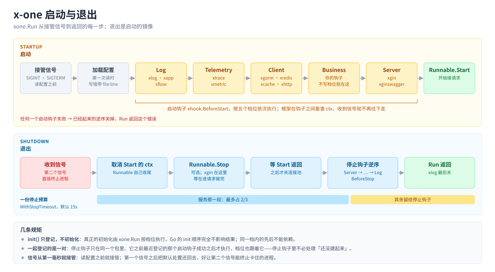

# 使用指南

从「跑起来了」到「上线」要知道的事，按用到的先后排。每个模块怎么用、全部配置字段在它目录下的 README
（见[模块一览](../README.md#模块一览)）；配置文件放哪、怎么叠查 [`config.md`](config.md)，报错查
[`troubleshooting.md`](troubleshooting.md)，为什么这样设计看 [`architecture.md`](architecture.md)。

| 术语 | 意思 |
|---|---|
| 模块 | Go module。核心是 `github.com/xiaoshicae/x-one`，带三方依赖的集成各自一个（`…/xgorm`、`…/xgin`……） |
| 集成 | 一个用 `xhook` 登记了启动 / 停止钩子的包：xlog、xgorm、xredis……你自己也可以写 |
| 实例 | 一个集成按配置建出来的一个 client，按名字取：`xgorm.C()` 是 `default`，`xgorm.C("report")` 是另一个 |
| 档位 | 钩子跑在哪一档（`xhook.Stage`）：日志 → 链路/指标 → 客户端 → 业务 → 服务，关闭时反过来 |
| 停止预算 | `xone.WithStopTimeout`（默认 15s）：从开始退出到 `Run` 返回的总时长，整个退出流程只有这一份 |

- [启动与关闭的全貌](#启动与关闭的全貌)
- [读自己的配置](#读自己的配置)
- [钩子与档位](#钩子与档位)
- [停止钩子：配对与继承](#停止钩子配对与继承)
- [Runnable](#runnable)
- [非 Web 服务：consumer / job](#非-web-服务consumer--job)
- [多实例](#多实例)
- [错误处理](#错误处理)
- [测试](#测试)
- [部署](#部署)
- [写一个自己的集成](#写一个自己的集成)

## 启动与关闭的全貌



```
启动：接管信号 → 加载配置 → StageLog → StageTelemetry → StageClient → StageBusiness → StageServer → Runnable.Start
退出：取消 Start 的 ctx → Runnable.Stop（可选）→ 等 Start 返回 → 停止钩子逆序（StageServer → … → StageLog）
```

`xone.Run` 阻塞到 `Start` 返回或者收到 SIGINT / SIGTERM，然后走退出流程。任何一个启动钩子失败，后面的不再跑，
已经起来的逆序关掉，`Run` 返回那个错误；`MustRun` 把它打到 stderr 并以 1 退出。

## 读自己的配置

业务自己的配置块和框架的走同一套规则：默认值预填在结构体里、字段拼错启动失败、`${VAR}` 照样生效、`Validate()` 在启动时就跑。

```go
c := Config{Topic: "orders", Workers: 4, Timeout: 5 * time.Second} // 默认值预填
if err := xconfig.Unmarshal("MyApp", &c); err != nil {
	log.Fatal(err)
}
xone.MustRun(&Consumer{workers: c.Workers, timeout: c.Timeout})
```

- **在 `Start` 之前任何时候读都行**：在 `main` 里、`xone.Run` 之前，或者一个 `BeforeStart` 钩子里；第一次读的时候框架才加载配置文件，
  读到的永远是最终值。**别只在 `Start` 里读**：全部启动钩子跑完时还没人读过的顶层 key 会让启动失败
  （`config keys [...] are not read by anyone`）。
- 结构体字段一定要写 `yaml` tag；要区分「没配」和「配了」用 `xconfig.Has("MyApp")`。

完整的例子、在钩子里读的写法、`Has` / `DecodeStrict` / `UnmarshalClients` 见 [xconfig](../xconfig/README.md)；
配置文件本身的规则（文件位置、Profile、Import、合并、占位符）见 [`config.md`](config.md)。

## 钩子与档位

在启动前、停止前做事，用两个钩子，里面写普通的 Go 代码：

```go
func init() {
	xhook.BeforeStart(warmup) // 不写档位就是 StageBusiness：所有客户端已就绪，服务还没接流量
	xhook.BeforeStop(flush)   // 只在上面那个 warmup 成功之后才会被调用
}

func warmup(ctx context.Context) error {
	return xgorm.CWithCtx(ctx).Find(&hotItems).Error
}
```

`init()` 里只登记，真正的执行由 `xone.Run` 按档位来，Go 的包初始化顺序不影响结果。
钩子收到的 `ctx` 在退出信号到达时被取消，会阻塞的调用要把它传下去。

| 档位 | 用在 | 谁在这一档 |
|---|---|---|
| `StageLog` | 最先起、最后关，其余组件的启停日志才写得出去 | xlog、xapp、xflow（只读配置） |
| `StageTelemetry` | 要早于客户端，客户端的 Span 才挂得上、指标才收得到 | xtrace、xmetric |
| `StageClient` | 被业务依赖的客户端 | xgorm、xredis、xcache、xhttp |
| `StageBusiness` | 你自己的业务资源：预热、定时任务、订阅。**不写 `At` 就是它** | 你的钩子 |
| `StageServer` | 对外服务：最后起、最先关 | xgin、xginswagger（读配置） |

只有必须早于或晚于别人时才写 `xhook.At(xhook.StageClient)` 之类。**同一档内的顺序是 Go 初始化包的顺序**：
同一份代码每次都一样，但由 import 关系和包路径的字典序决定，不是 import 语句的书写顺序——有先后要求的放进不同档位。

## 停止钩子：配对与继承

**一起登记的就是一对**：停止钩子和同一个包里、在它之前最近登记的那个启动钩子配对，只在那个启动钩子成功之后才执行。
所以停止钩子里不必处理「还没建起来」。

- 停止钩子**不写档位就继承配对的启动钩子的档位**，于是一个资源只在启动钩子上写一次 `At` 就管住了两头；显式写了 `At` 的以它为准。
- 之前没有启动钩子的停止钩子不依赖启动，总会执行——哪怕 Runnable 写错、配置读不出来，一个启动钩子都没跑。
- 一个包管好几样资源时一样一对地登记：

  ```go
  xhook.BeforeStart(openA)
  xhook.BeforeStop(closeA)
  xhook.BeforeStart(openB)
  xhook.BeforeStop(closeB)
  ```

  `openB` 失败时 `closeA` 照常执行、`closeB` 不执行。「哪个包」按登记时调用栈上的那个 `init` 认。
- 每个停止钩子都有时限：排在后面的钩子各自留着一份（`min(1s, 剩余时间 ÷ 钩子数)`），一个关不掉的连接池吃不掉别人那份。

## Runnable

交给 `xone.Run` 的只要实现一个方法：

```go
type Runnable interface {
	Start(context.Context) error
}
```

- `Start` 在所有启动钩子之后调用，`ctx` 取消时返回即可；干完活 `return nil` 就是一次性任务，框架随即走正常的逆序关闭。
- 光靠 `ctx` 停不下来的（比如要调 `http.Server.Shutdown`）再加一个 `Stop(ctx context.Context) error`，可选。
  框架退出时先调它、再等 `Start` 返回。`Stop` 收到的是一个独立的 ctx，带着服务那一段预算。
- 服务那一段（`Stop` 加上等 `Start` 返回）最多用停止预算的 **2/3**（默认 10s），到点框架就不再等它、接着关各组件。
- `Stop` 的签名写错（少了 `ctx`），或者写在指针上、传进来的却是值，`Run` 直接报错——否则它永远不会被调到。

`xgin.New()` 就是一个 Runnable。不想为此写一个类型的，用这两个现成的：

| | 什么时候用 | Run 什么时候收尾 |
|---|---|---|
| `xone.Func(fn)` | 一次性任务；自己写循环的消费者 | `fn` 返回时，`fn` 的错误就是 `Run` 的错误 |
| `xone.UntilSignal()` | 活全在钩子里：`BeforeStart` 里启动、`BeforeStop` 里关（SDK 自带协程的推送式消费者、只有后台任务的进程） | 收到退出信号时 |

```go
// 一次性任务：钩子把 xgorm 建好，干完活返回，框架逆序关掉
xone.MustRun(xone.Func(func(ctx context.Context) error {
	return xgorm.CWithCtx(ctx).Exec("UPDATE orders SET status = 'expired' WHERE expires_at < now()").Error
}))

// 活全在钩子里：跑完启动钩子就停在这，收到信号再跑停止钩子
xone.MustRun(xone.UntilSignal())
```

## 非 Web 服务：consumer / job

xgin 没有特殊地位，它只是一个 Runnable。消费者服务要做的只是写一个 `Start`：

```go
func (c *Consumer) Start(ctx context.Context) error {
	for range c.workers {
		c.wg.Add(1)
		go func() { defer c.wg.Done(); c.loop(ctx) }() // ctx 取消 → 不再取新消息
	}
	c.wg.Wait()        // 等在途消息做完
	return c.q.Close() // 在途消息做完之后才 Close
}

func (c *Consumer) loop(ctx context.Context) {
	for {
		m, ok := c.q.Next(ctx)
		if !ok {
			return
		}
		mctx, cancel := context.WithTimeout(context.WithoutCancel(ctx), c.timeout)
		_ = c.handle(mctx, m) // 处理中的消息不跟着退出信号一起被取消
		cancel()
	}
}

func main() { xone.MustRun(&Consumer{q: client, workers: 4, timeout: 5 * time.Second}) }
```

**三个容易踩的地方**，[`example/consumer/`](../example/consumer/) 里每一条都有测试钉着：

| | 为什么 |
|---|---|
| `Start` 必须等在途消息做完再返回 | 框架在 `Start` 返回**之后**才关数据库和缓存。提前返回，还在处理的消息就会摸到已经关掉的连接池 |
| 处理消息用的 ctx 要 `context.WithoutCancel` | 沿用已取消的 ctx，这条消息里每一次写库、调下游、连最后那次 `Ack` 都会一进去就被拒绝 |
| 在途消息做完之前别 `Close` 客户端 | 多数客户端 `Close` 时会顺带提交 offset，提前提交 = 退出时静默丢消息。也别在 `Stop` 里关：框架先调 `Stop`、再等 `Start` 返回，此刻 worker 还在处理 |

**单条消息的处理超时必须小于服务那一段停止预算**（`WithStopTimeout` 的 2/3，默认 10s），否则框架等不到就往下关资源了。

上面的 `Consumer` 也可以不写类型，把 `Start` 的内容放进 `xone.Func(func(ctx context.Context) error { … })`；三条规矩不变。
一次性任务（迁移、批处理）用 `xone.Func`，干完 `return nil`，见 [Runnable](#runnable)。

## 多实例

`xgorm` / `xredis` / `xcache` 可以在配置的 `Clients` 下按名字写好几个实例：

```go
xgorm.C()                  // default 那个
xgorm.C("report")          // Clients.report
xgorm.CWithCtx(ctx, "report")
xgorm.Has("report")        // 配了没有，给可选依赖用
xgorm.Names()              // 已配置的实例名，排好序
```

- 在 `xone.Run` 把它建起来之前（或者关掉之后）调 `C()` 会 panic，并说清是调早了、调晚了、没配、还是名字写错，见
  [troubleshooting.md「取实例」](troubleshooting.md#取实例c)。在 `Start`、请求处理、默认档及之后的钩子里用都没问题。
- 启动时按名字排序挨个建，有一个建不起来就把已建好的全关掉，错误里点名是哪一个。
- `xhttp` 例外：只有一个客户端，任何时候 `xhttp.C()` / `xhttp.R(ctx)` 都可用；要第二套配置就 `xhttp.New(cfg)` 自己建。

## 错误处理

框架返回的错误都是 `*xerror.Error`，带着模块名和操作名，渲染成 `xone <模块> <op> failed, err=[<原因>]`：

```
xone xgorm connect failed, err=[authentication to db:5432 failed: FATAL: password authentication failed …]
```

```go
if err := xone.Run(app); err != nil {
	switch {
	case xerror.Is(err, "xconfig"):   // 整棵错误树里有没有 xconfig 报的（配置写错了）
	case xerror.Module(err) == "xgorm": // 最外层是谁报的
	}
	var pgErr *pgconn.PgError
	if errors.As(err, &pgErr) { /* 底层错误一路用 %w 包着，errors.Is / As 照常取得到 */ }
}
```

- `xerror.Is` 遍历整棵树（包括 `errors.Join`），`xerror.Module` 只看最外层。`Run` 把启动错误和关闭时的错误 Join 在一起，主因在最前面。
- op 是固定的一组词：`config`（配置不合法）、`init`、`new`、`connect`（建连、探测）、`close`、`register`、`start` / `stop`、`execute`（xflow）。
- 业务调用（`xgorm.C().First(...)`、`xredis.C().Get(...)`）返回的是原生库的错误，框架不包。

## 测试

两种办法，按要测的东西选：

**绕开框架，直接 `New`。** 每个集成都导出纯构造器，不碰全局、不读文件：

```go
c := xgorm.DefaultClientConfig() // 带着全部默认值，只改要改的
c.DSN = dsn
db, closer, err := xgorm.New(ctx, c)
if err != nil {
	t.Fatal(err)
}
t.Cleanup(func() { closer.Close() })
```

会阻塞的（`xgorm`、`xredis`、`xtrace`）收 `ctx`，不会阻塞的（`xlog`、`xmetric`、`xcache`、`xhttp`）不收。
`New` 的参数是单个实例的配置（`xgorm.ClientConfig`、`xredis.ClientConfig`、`xcache.ClientConfig`，其余模块是 `Config`），
一定从 `DefaultClientConfig()` / `DefaultConfig()` 改起：零值结构体过不了校验（比如 `MaxOpenConns` 必须 > 0）。

**要测「按配置装起来」的那条路，用 `xonetest`：**

```go
func TestInitXKV(t *testing.T) {
	xonetest.UseConfigYAML(t, "XKV:\n  Path: "+filepath.Join(t.TempDir(), "kv.json")+"\n")
	xonetest.StartHooks(t) // 按档位跑启动钩子；测试结束时跑配对的停止钩子
	if xkv.C() == nil {
		t.Fatal("xkv not initialized")
	}
}
```

- `UseConfig(t, path)` / `UseConfigYAML(t, yml)` 让这个测试读指定的配置，`Import`、profile、`${VAR}` 照常生效；测试结束时清掉。
- `StartHooks(t)` 跑这个测试二进制里登记过的全部钩子（被测包连同它 import 的集成）。不起服务、不接管信号、
  不检查没人读的 key——那些要测就直接调 `xone.Run`。
- 配置和钩子是进程级的全局状态，**用了 `xonetest` 的测试不能 `t.Parallel`**。

## 部署

- **终止宽限期要比停止预算长。** `xone.WithStopTimeout`（默认 15s）是从开始退出到 `Run` 返回的上限，K8s 的
  `terminationGracePeriodSeconds`（默认 30s）留得比它长即可，不必再对齐别的数。xgin 等在途请求用的是其中 2/3。

  ```go
  xone.MustRun(app, xone.WithStopTimeout(25*time.Second))
  ```

  `WithStopTimeout` 必须 > 0，给 0 或负数 `Run` 什么都不做就返回错误。
- **第二个信号立即终止。** 第一个 SIGINT / SIGTERM 触发优雅退出，同时把系统默认处置还回去；卡住时再发一次，进程当场退出。
- **启动期间收到信号**：不再启动服务，已建好的逆序关掉，以 0 退出——滚动更新撞上这个窗口不会留一条「启动失败」。
- **配置文件和 profile**：镜像里放 `conf/application.yml`，环境差异放 `application-<env>.yml`，用 `XONE_PROFILE` 选；
  凭证写成 `${VAR}` 从环境变量来。
- **在负载均衡后面**：把它的网段写进 `XGin.TrustedProxies`，否则 `client_ip` 是负载均衡的地址、透传 Header 一个都不收。
- **健康检查**：框架不内置，自己挂一个路由；服务在全部启动钩子成功之后才开始监听。

## 写一个自己的集成

一个集成就是一个包：纯构造器 `New`，两个钩子把它接进框架，再给使用者一个 `C()`。只 import `xhook` 和 `xconfig`：

```go
package xmine

import (
	"context"
	"io"
	"sync"

	"github.com/xiaoshicae/x-one/xconfig"
	"github.com/xiaoshicae/x-one/xhook"
)

const ConfigKey = "XMine"

type Config struct {
	Addr string `yaml:"Addr"` // 一定要写 yaml tag
}

func DefaultConfig() Config { return Config{Addr: "127.0.0.1:1234"} }

// Validate 读配置时就调，配错的值在启动时失败
func (c Config) Validate() error { /* ... */ return nil }

// New 纯构造：不碰全局、不读文件、不依赖框架。会阻塞（建连、探测）的才收 ctx
func New(ctx context.Context, c Config) (*Client, io.Closer, error) { /* ... */ }

func init() {
	xhook.BeforeStart(initXMine, xhook.At(xhook.StageClient)) // 被业务依赖的客户端；业务资源不写档位
	xhook.BeforeStop(closeXMine)                               // 档位跟着上面那个启动钩子
}

var (
	mu     sync.RWMutex
	client *Client
	closer io.Closer
)

func initXMine(ctx context.Context) error {
	c := DefaultConfig()
	if err := xconfig.Unmarshal(ConfigKey, &c); err != nil {
		return err
	}
	cl, cls, err := New(ctx, c)
	if err != nil {
		return err
	}
	mu.Lock()
	client, closer = cl, cls
	mu.Unlock()
	return nil
}

// closeXMine 只在 initXMine 成功之后才会被调到，不必处理「还没建起来」
func closeXMine(context.Context) error {
	mu.Lock()
	defer mu.Unlock()
	return closer.Close()
}

// C 给使用者的入口：返回原生类型
func C() *Client {
	mu.RLock()
	defer mu.RUnlock()
	return client
}
```

要点：

- **不许 import 根包** `github.com/xiaoshicae/x-one`，只 import `xhook` / `xconfig`：集成不认识框架本体，所以单独发成一个 module 也成立。
- 错误用 `xerror.New` / `xerror.Newf` 在模块边界包一次，底层错误用 `%w`；错误和日志消息用英文——它们会落进使用者的日志平台。
- 带三方依赖的集成做成独立的 Go module，别让它的依赖进使用者的模块图。
- 「没配就不建」的集成先问 `xconfig.Has(ConfigKey)`：问过就算认领，不会被当成没人读的 key。
- 用 `xonetest` 测钩子，见[上文](#测试)。

**多实例**：读配置换成 `xconfig.UnmarshalClients`，它看有没有 `Clients` 决定按哪种写法解，两种混着写是错误，
每个实例都先铺上默认值再解：

```go
func initXMine(ctx context.Context) error {
	clients, err := xconfig.UnmarshalClients(ConfigKey, DefaultConfig) // map[名字]Config；整块没配时是 nil
	if err != nil {
		return err
	}
	// 按名字排序挨个 New，中间有一个建不起来就把已经建好的全关掉再报错——
	// 启动钩子失败时框架不会调本包的停止钩子，不自己收拾就会漏掉那几个
	return buildAll(ctx, clients)
}

func C(name ...string) *Client // 不带参数取 xconfig.DefaultClientName（"default"）
func Has(name ...string) bool
func Names() []string
```

存到哪还是本包自己的事，一个加锁的 map 就够了。本仓库的 xgorm / xredis / xcache 共用的那份实现是 internal 的，不对外。

可运行的完整样例：[`example/component/`](../example/component/)——一个自己写的集成（`xkv/`）、一个业务配置块（`conf/`）和一个用到它们的服务。
